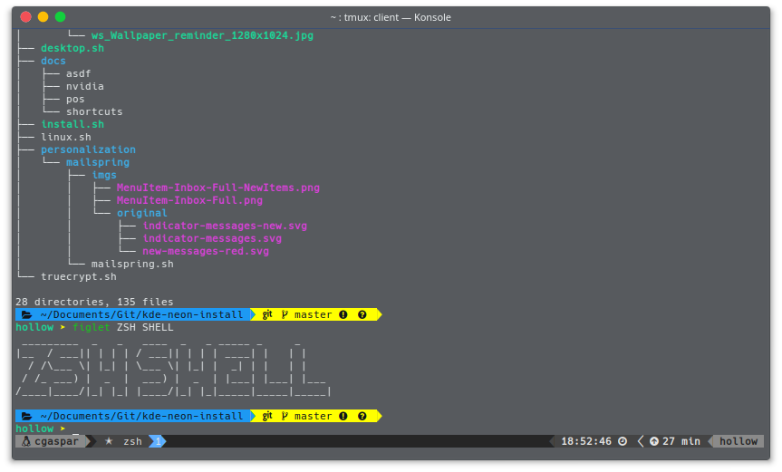

# Configuração do terminal com Zsh

Configuração de ambiente shell para utilização em KDE Neon e Ubuntu.



> É necessário instalar e configurar a fonte Hack Nerd Font no terminal.

## Ambiente

Os seguintes programas fazem parte da configuração de ambiente:

* [Zsh](https://www.zsh.org/)
* [Oh My Zsh](https://ohmyz.sh/)
* [Vim](https://www.vim.org/)
* [Tmux](https://github.com/tmux/tmux/wiki)
* [ASDF](https://github.com/asdf-vm/asdf)

## Iniciar configuração

```bash
$ git clone https://github.com/RasecRapsag/shell-zsh-config
$ cd shell-zsh-config
$ zsh install.sh
```
